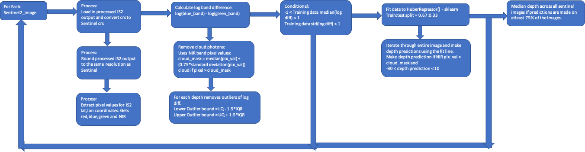

Setup 

In working directory, there should be a folder called data containing a subfolder for each reef being analyzed. Within each subfolder should be the following folders/files:
 
<blockquote>
- a GeoJSON file containing the outline of the reef, named reef_name.geojson. This file is obtained from www.geojson.io/. Switch to "OSM model" in bottom left corner of window, create a polygon of reef with the cursor, save points using the menu at upper left (save->GeoJSON), then rename map.geojson file and move to data directory.
  
Run depth_profile.py for the reef. Output will be saved in data/reef_name/Output/Data_Cleaning/Processed_output
</blockquote>   

Functions  
1. prep_df( sf (Sentinel2_image object) , fp (str) , crs (dict) ) - helper function to load in ICESAT2 training data file and convert it to the crs of the Sentinel method. 
Returns - pd.DataFrame - depth prediction
 

2. load_ICESAT_predictions( icesat_proc_path (str) , sf (Sentinel2_image object) ) - concatenates all ICESAT2 training data into one dataframe.  
Returns pd.DataFrame - training data
 

3. get_regressor( reef (Coral_Reef Object) , sf (Sentinel2_image object) ) - uses the training data and pixel values to create a linear regression.  
Returns lambda - for linear regression  
dict - containing metadata about sentinel image  
pd.DataFrame - containing training data (depth, pixel values) 
 

4. get_pixel_val( coord (Coordinates) ) - returns the pixel values across different bands in the Sentinel image for the passed in coordinates. Inner function in get_regressor(). 
Return [band2, band3, band4, band8]
 

5. extract_pixel_cols( df (pd.DataFrame) ) - explode list of band pixel values to separate columns for each band. Inner function in get_regressor().  
Return pd.DataFrame - same as input df, but with added columns for each band
 

6. remove_log_outliers( data (pd.DataFrame) ) - iterates through training depths 0.5m at a time and removes all log difference outliers.  
Returns pd.DataFrame - excluding outliers
 

7. predict_reef( reg (lambda function), sf (Sentinel2_image object), master_df (pd.DataFrame) ) - Make predictions for the rest of the reef, by passing log band values into reg. 
Return str - outpath to depth predictions for the entire reef  
pd.DataFrame - contains depth predictions across multiple sentinel images.
 

8. all_safe_file( reef (Coral_Reef Object) ) - controller function to make depth predictions for reef over all Sentinel images. Also creates visualisations for the same. 
Return dict - sentinal image: [regressor,metadata,training data]  

 
To run on a single Sentinel2 image:  
• master_df = pd.DataFrame()	 
• reg, meta, data = get_regressor(reef, safe_file)  
•	preds,master_df = predict_reef(reg,safe_file, master_df) 
 
To plot import src.Reef_plots as reef_plots  
reef_plots.plot_reefs(preds,data,safe_file,reg)

 
 
Sample Output   

