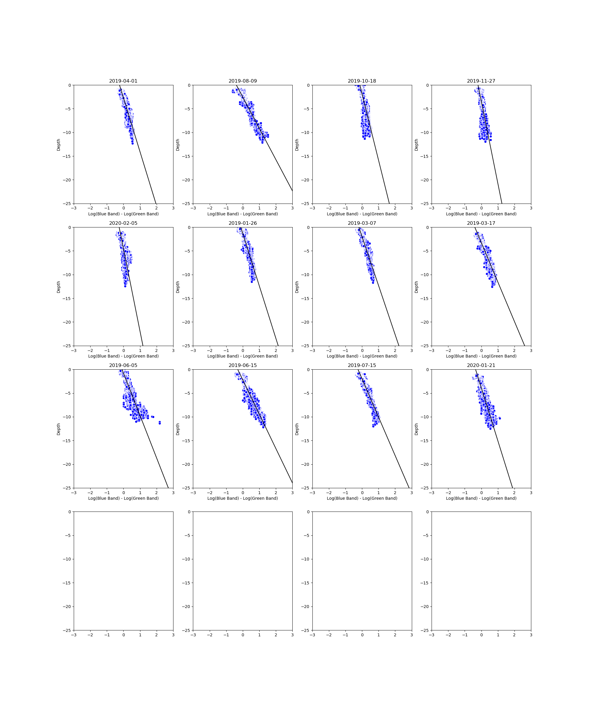

# Coral-Reef-Bathymetry

Applying DBSCAN on photon clouds from ICESAT-2 satellite. 

Mapping log difference of blue and green bands of Sentinel-2 image to depths from previous steps  

Predicting the depth of the rest of the reef using the same mapping

